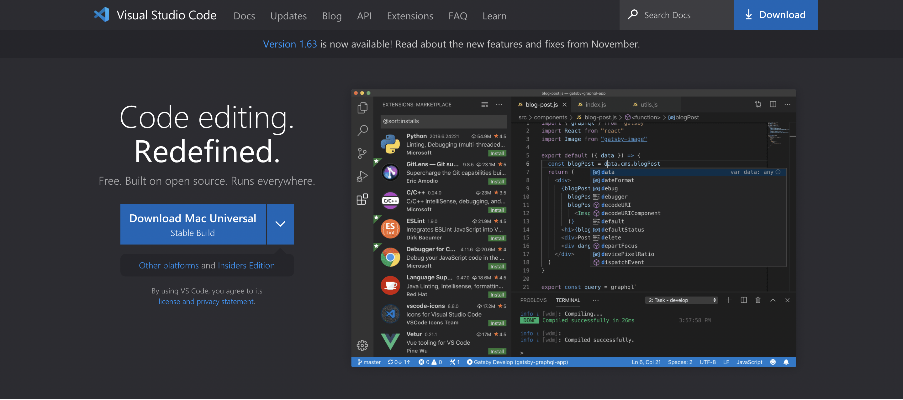
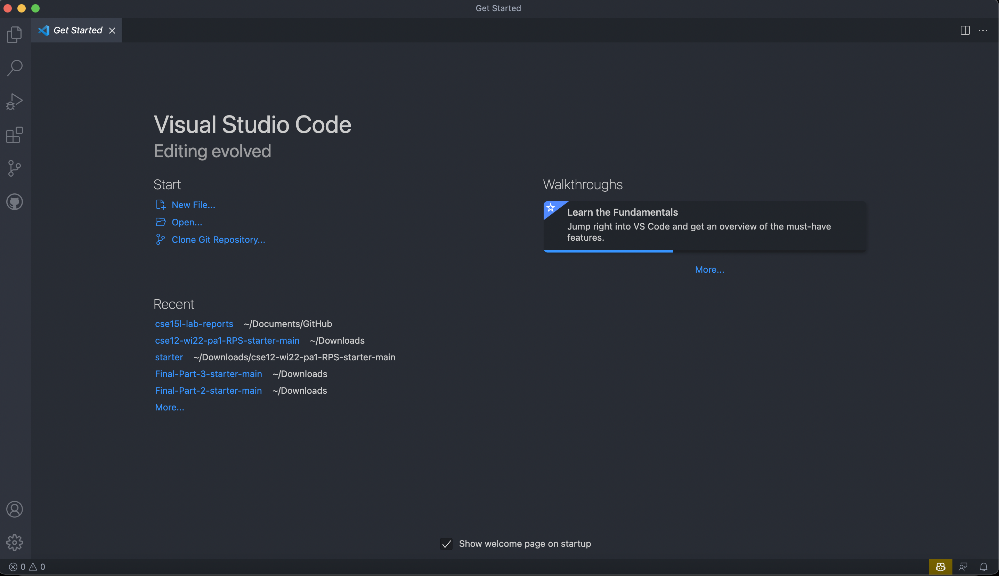
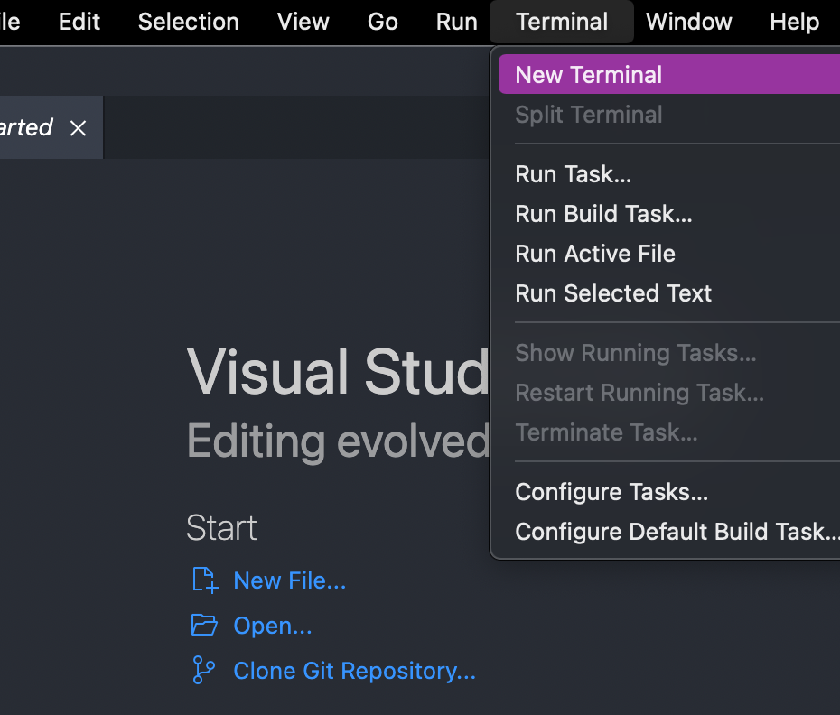
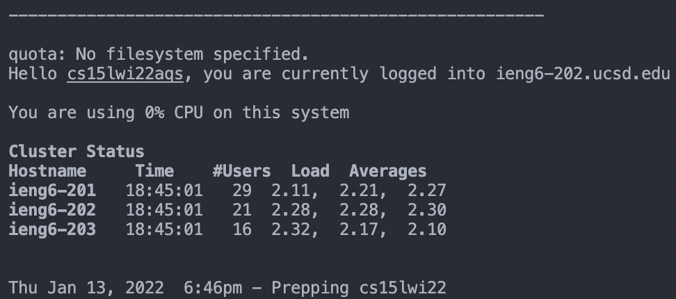
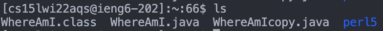
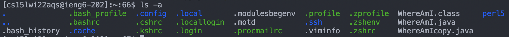
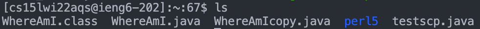
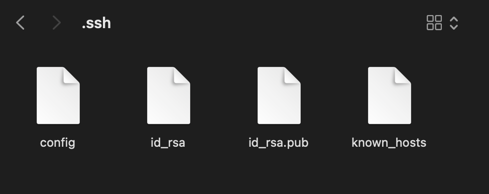
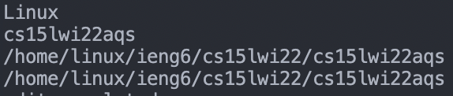

# Lab Report 2

Hello CSE 15L!
Here is a tutorial for doing all the starting things you'll need for Labs

Including but not limited to:

- Installing VScode
- Remotely Connecting
- Trying Some Commands
- Moving Files with scp
- Setting an SSH Key
- Optimizing Remote Running
So let us get started!

---

## Installing VSCode

VSCode will be the main programming thingamajig you will be using throughout the course.

You can get it from this neat [site](https://code.visualstudio.com/).


Smash that big ol blue download button right in the middle to get that application onto your machine, mine being a mac.

After going through the basic installing, you should get a page that should look like dis (give or take a little bit, I have a few extra addons):


Now to access this funky terminal incorporated within the VSCode app, there's this place at the top of the screen (for my mac at least) where you can choose to open a new terminal for you to use.


Good good! How wonderfully amazing. You have successfully completed the first part of this tutorioal!

---

## Remotely Connecting


We can use the terminal to connect to the official lab computers in UCSD remotely, I will show you how to do so.

Mac already has SSH so we needn't worry about other configuration issues

[Here](https://sdacs.ucsd.edu/~icc/index.php) you can find the username to use for the connection by entering your profile information.

Then you can proceed to connect by entering this into your terminal replacing the `zz` with the letters of your account username:

```bash
ssh cs15lwi22zz@ieng6.ucsd.edu
```

You can then enter your password to log in (Your entered password will be invisible). You should see this if you have correctly logged in:


---

## Trying Some Commands

Some commands you can use in the terminal to explore this remote server are `ls` and `cd`.

You can also investigate other parameters for commands, like `ls -a` which will show all files, even hidden ones.


---

## Moving Files with scp

`scp` is a command you can use to copy files from your computer over to the server. You can use this to send files you want to run over to the server to run them there.
For example, to copy a file from your downloads folder to the server, you simply have to use:

```bash
scp ~/Downloads/testscp.java cs15lwi22zz@ieng6.ucsd.edu:~/    
```

Which copies the file from Downloads and places it in your directory on the server.

As you can see here:


After using the scp command, my file now appears on the server side as well.

---

## Setting an SSH Key

`ssh-keygen` is a command that helps to generate keys. This generates two keys, a public key and a private key, the private key is kept for yourself, and the public one given to others to validate your private key.

This command will create and store your keys in this location in your computer `/Users/username/.ssh/`, the id_rsa file being the private key and the id_rsa.pub being of course the public key.


You can then copy (psst remember scp from before?) the public key from your computer onto `cs15lwi22zz@ieng6.ucsd.edu:~/.ssh/authorized_keys`
And bam! Now you can ssh into the server and scp into the server all without the hassle of passwords, and can use them much easier with your keys doing all the validation hard work.

---

## Optimizing Remote Running

Now that things have gotten much easier to use with keys, why not try simplifying that process *even* more?

Firstly, to run code on the server without having to enter ssh mode, you can do something like `ssh cs15lwi22aqs@ieng6.ucsd.edu "ls"` to run it directly. We will be abusing this.
Secondly, to run multiple commands in any terminal on one line, we can simply separate commands with `;`. Like this: `javac blah.java; java blah`. We will be abusing this even more.

Say you wanted to upload a local java file onto the server and then compile and run it. With this great amalgamation one line command, you can do it all in one tap.

```bash
scp ~/Downloads/WhereAmI.java cs15lwi22aqs@ieng6.ucsd.edu:~/; ssh cs15lwi22aqs@ieng6.ucsd.edu "javac WhereAmI.java; java WhereAmI"
```

Which will directly result in the finished in only two keystrokes! An up arrow key to recall that last command, and an enter to execute it, as simple as it gets:

