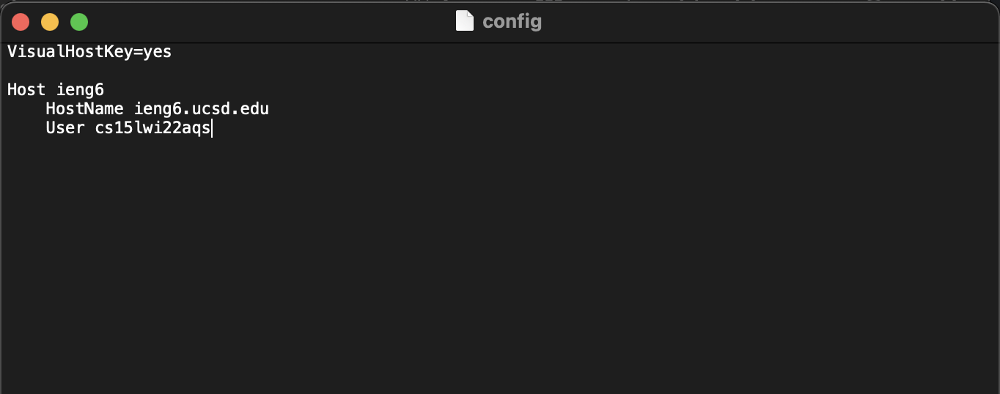
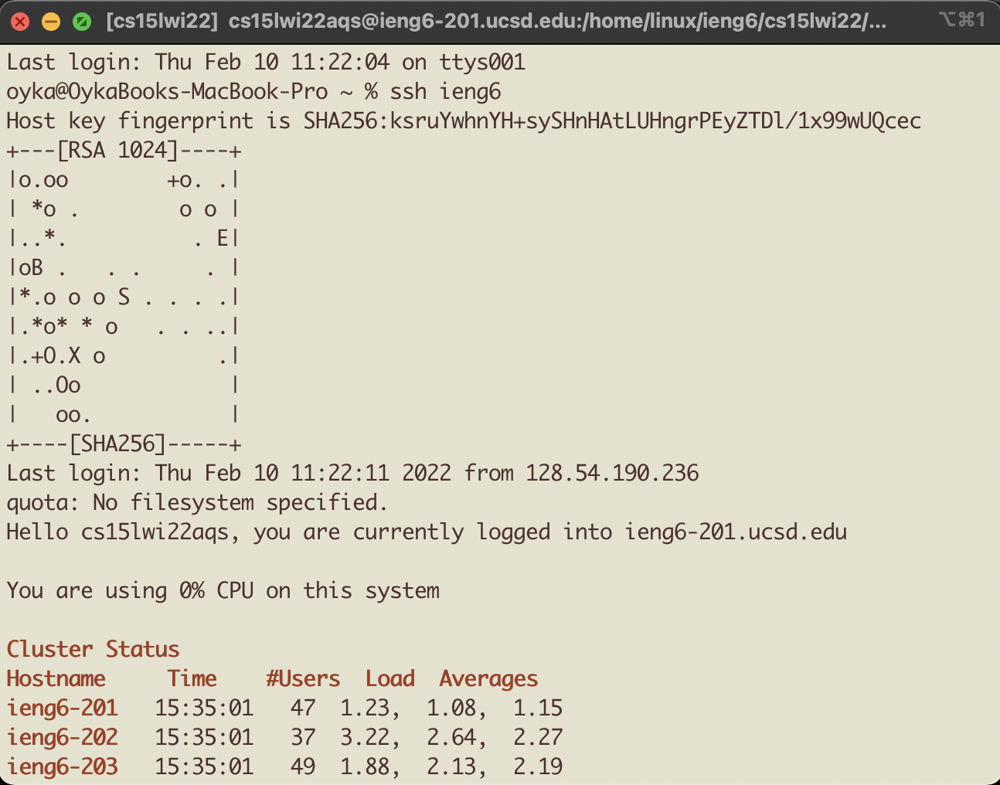
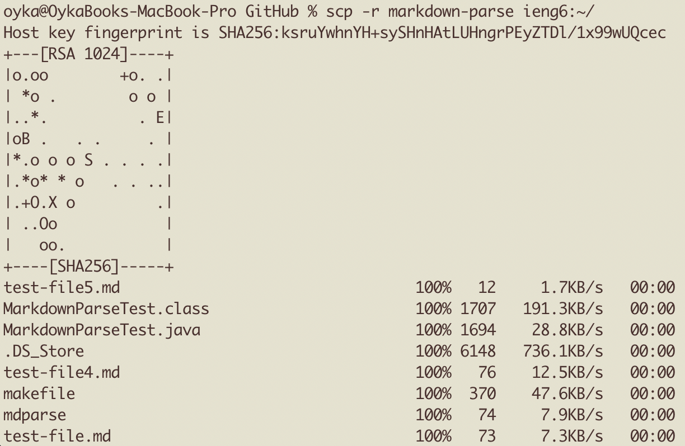

# Lab Report 3

## Streamlining ssh Configuration

This is my ssh config file. I simply edited my ssh config file with the default textedit prorgam, adding a new host ieng6 to make logging in via ssh much easier.

As can be seen above, I am able to log in directly by using `ssh ieng6`.

Then, with this config setup, I can also copy files much easier, using only `scp ~/Downloads/test.sh ieng6:~/` to copy my file over instead of the entire server name.

---

# Ignore everything below, the first option is chosen.

<s>

## Setup Github Access from ieng6

Here is the public key in my github account.

Here is the private key on my ieng6 account.

Here I create a new file and commit it on my ieng6 account.

Here I am able to directly push the new update to github with the ssh keys.

[Here is the link for the actual commit](https://github.com/qiwenkevin/SkillDemo/commit/9dff0e9683efcf47faaa2fc19060d2d9d9778ac0)

---

## Copy whole directories with scp -r

Here I can copy my whole markdown-parse directory into my ieng6 account.

Here you can see that the copied directory works and I can compile and run all the tests.

Next, say we wanted to do this with one command, well, using `scp -r ~/Documents/GitHub/markdown-parse ieng6:~/; ssh ieng6 "cd ~/markdown-parse; make Test"` we can make that happen.

