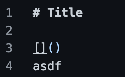
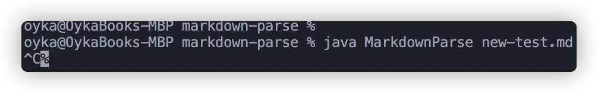
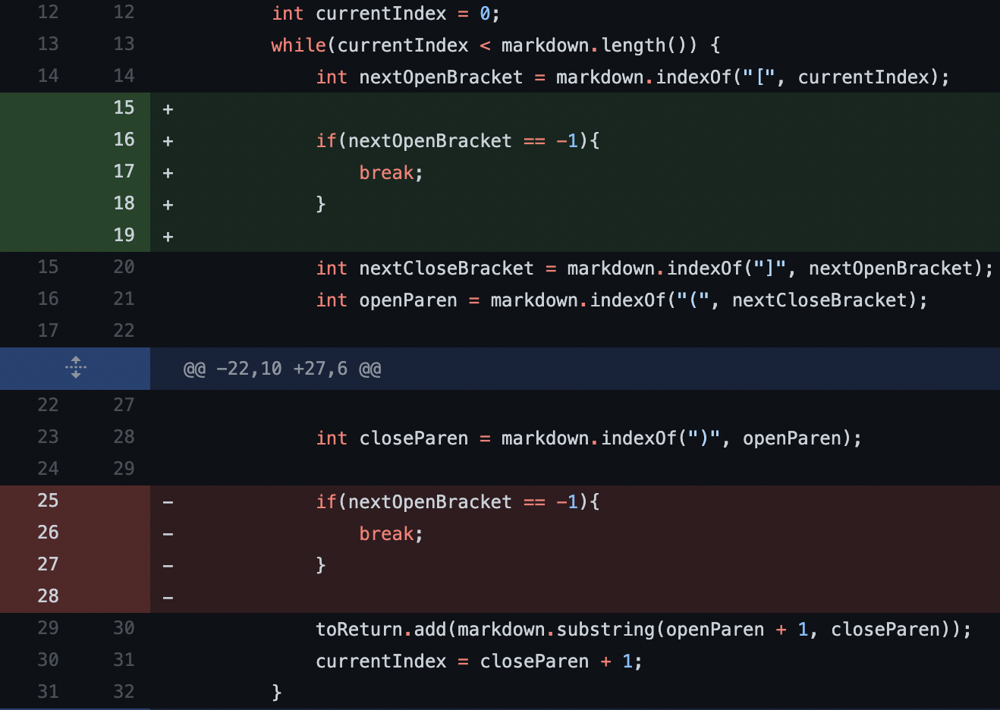
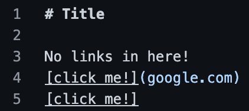
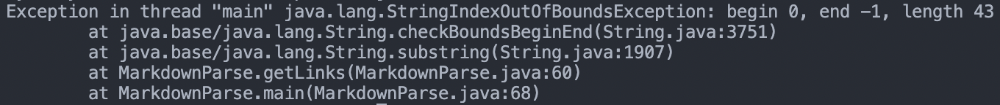
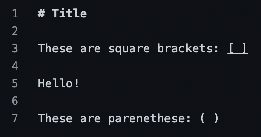
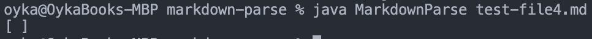

# Lab Report 3

Week 4

## Three Bugs

---

## Bug 1: Infinite loop when only one bracket

### The Fix

### Source of the issue

### Symptom

The bug here is caused by the input of link pair with more stuff at the end of the file, which results in the symptom of the programming running in an infinite loop, which needs to be forcefully halted.
The fix was to check if the next open bracket was found, so we can break the loop if it isn't found.

---

## Bug 2: Infinite loop when [] is used without ()

### Source of the issue

### Symptom

The bug here is caused by the input of only brackets and no use of parentheses, resulting in the symptom of infinite loop.
The fix was to move the check up, so the issue 

---

## Bug 3: [] and () used apart and not for links

### Source of the issue

### Symptom

