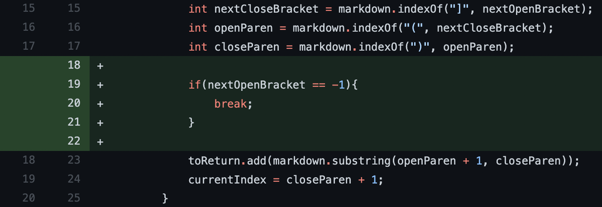
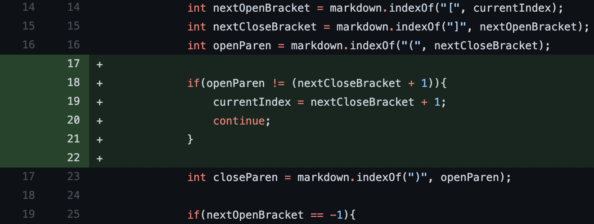
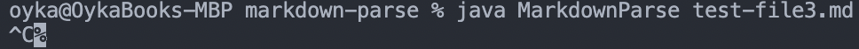

# Lab Report 3

Week 4

## Three Bugs

---

## Bug 1: Infinite loop when only one bracket

### The Fix

### Source of the issue

#### [Here is the link to file](test1.md)

### Symptom

The bug here is caused by the input of link pair with more stuff at the end of the file, which results in the symptom of the programming running in an infinite loop, which needs to be forcefully halted.
The fix was to check if the next open bracket was found, so we can break the loop if it isn't found.

---

## Bug 2: Infinite loop when [] is used without ()

### Source of the issue

#### [Here is the link to file](test2.md)

### Symptom

The bug here is caused by the input of only brackets and no use of parentheses, resulting in the symptom of infinite loop.
The fix was to add a check to see if openParen was right after the closeBracket so that if it is not found there, we will move the current index forwards, and continue to the next loop.

---

## Bug 3: [] and () used apart and not for links

### Source of the issue

#### [Here is the link to file](test3.md)

### Symptom

The bug here is caused by the use of brackets and parenetheses separately, resulting in the symptom of links where there shouldn't be any.
The fix was to add the same check as above to see if openParen was right after the closeBracket so that if it is not found there, we will move the current index forwards, and continue to the next loop. Skipping the incorrect brackets.
