# Lab Report 4

Here are the repositories used in this lab:

[My Group's Repo](https://github.com/JaredJose/markdown-parse)

[Reviewed Group's Repo](https://github.com/christopherthomason/markdown-parse)

## Snippet 1

```text
`[a link`](url.com)

[another link](`google.com)`

[`cod[e`](google.com)

[`code]`](ucsd.edu)
```

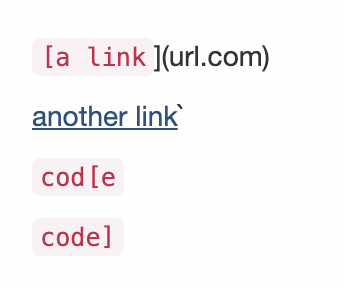
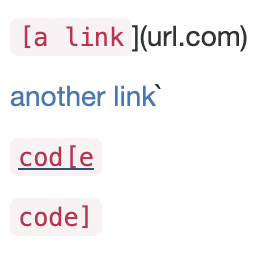
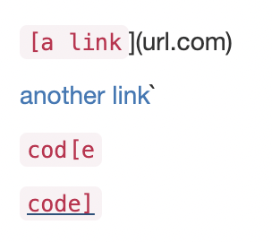

We can see from the above that the three bottom links should be recognized as normal links, because they are underlined when moused over.

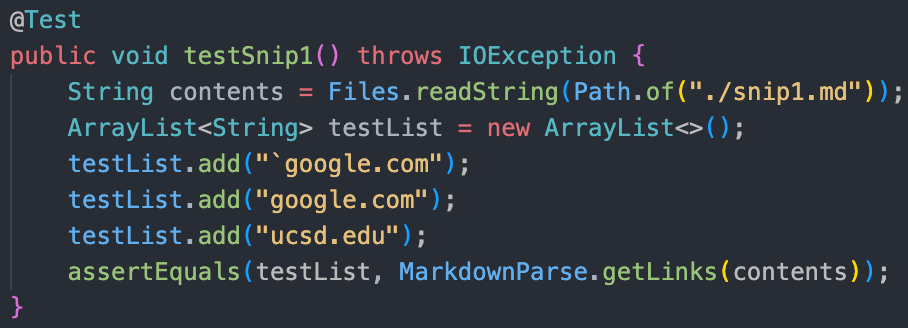

Here is the implementation for testing the first snippet, after adding in snippet 1 as a markdown file.

### My Group implementation results

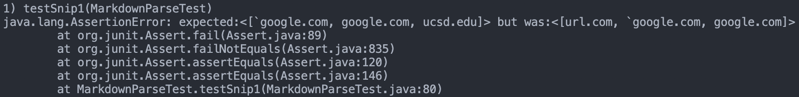

### Reviewed Group implementation results

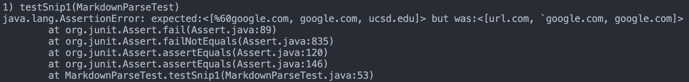

---

## Snippet 2

```text
[a [nested link](a.com)](b.com)

[a nested parenthesized url](a.com(()))

[some escaped \[ brackets \]](example.com)
```

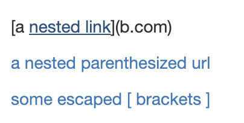
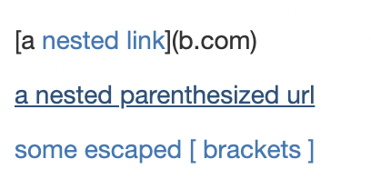
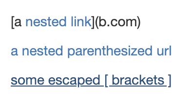

We can see from the above that all three links should be recognized as normal links, because they are underlined when moused over.

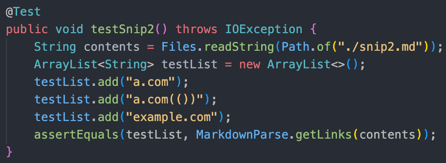

Here is the implementation for testing the second snippet, after adding in snippet 2 as a markdown file.

### My Group implementation results

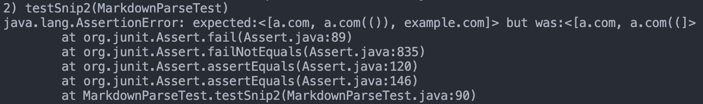

### Reviewed Group implementation results

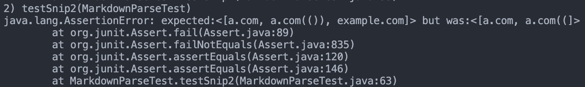

---

## Snippet 3

```text
[this title text is really long and takes up more than 
one line

and has some line breaks](
    https://www.twitter.com
)

[this title text is really long and takes up more than 
one line](
    https://ucsd-cse15l-w22.github.io/
)


[this link doesn't have a closing parenthesis](github.com

And there's still some more text after that.

[this link doesn't have a closing parenthesis for a while](https://cse.ucsd.edu/


)

And then there's more text
```

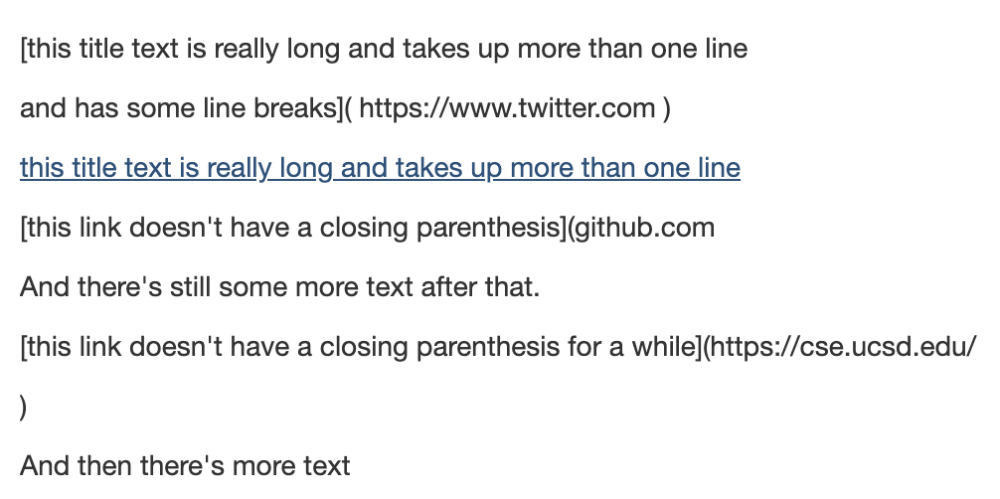

We can see from the above that only one link should be recognized as normal links, because it's the only one underlined when moused over.

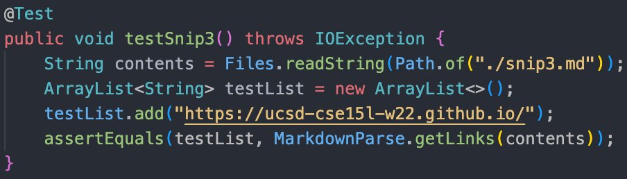

Here is the implementation for testing the third snippet, after adding in snippet 3 as a markdown file.

### My Group implementation results

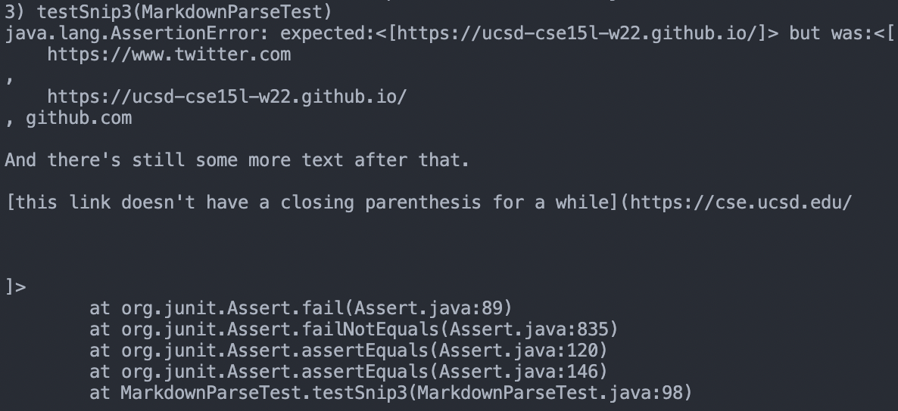

### Reviewed Group implementation results

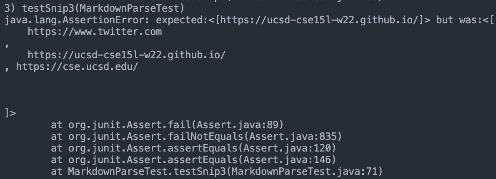

---

## Questions

- Do you think there is a small (<10 lines) code change that will make your program work for snippet 1 and all related cases that use inline code with backticks? If yes, describe the code change. If not, describe why it would be a more involved change.
  - For snippet one, we did not really account for the effect of backticks in markdown files. Such a change will be rather involved and long, mostly because of the complex behavior of code blocks that need to take a lot of edge cases into consideration. For example, I first thought of just adding an if else loop within the main while loop and have a boolean keep track of whether or not we are in a code block, and if we are, just move currentIndex to the next index until we escape the code block. But then I also realized issues with very specific cases such as: because with single backticks, we also escape code block at line breaks; backticks in the parentheses are considered part of the url, which don't enter code block; triple backticks are special and can have line breaks in them; All these things makes adding this change very long to achieve. 
- Do you think there is a small (<10 lines) code change that will make your program work for snippet 2 and all related cases that nest parentheses, brackets, and escaped brackets? If yes, describe the code change. If not, describe why it would be a more involved change.
  - There were a few things we didn't take into consideration for this snippet. First, is the issue with nested parentheses. As found in the CommonMark demo site, the correct link for the second link should be `a.com(())`, which means that we will have to keep track of a stack of parentheses in order to make sure we end the link on the last and correct parenthese for closing the link. This implementation of a stack will obviously be a very involved change, adding in a new data structure to take care of. Secondly, we did not account for the use of backslashes to escape symbols, which will also need a few more lines of changes, although this should be simpler as we can simply skip forwards the currentIndex to the next character after the escaped symbol, but will still add on to the code changes needed for fixing this snippet.
- Do you think there is a small (<10 lines) code change that will make your program work for snippet 3 and all related cases that have newlines in brackets and parentheses? If yes, describe the code change. If not, describe why it would be a more involved change.
  - This snippet was probably the most problematic of the three cases where our tests failed. We completely ignored line breaks and their effects on whether something is a link or not. This is a rather messy change to make again, because of the different times line breaks will mean different things. Secondly, We also need to remove spaces from links, which will again require extra processing of a couple more lines of code for removing the spaces on both sides of the links.
