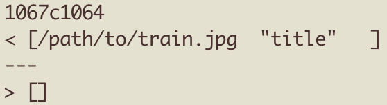

# Lab Report 5

## How to find different resutls?
First of all, by using `bash script.sh > results.txt` we can put all the output from the script into one text file, this will set us up to compare the results of the two different programs much easier.

When we have both of the results.txt, we can simply utilize the `diff` command to compare the two text files. Using `diff diff our-markdown-parse/results.txt markdown-parse/results.txt` we can compare the lines which are different in the results.

## One test that was different

On line 1067 in our group's results.txt, we had a different output than that of the given markdown-parse.

By going to line 1067 in the results, we can see the file that corresponded to this output.

And finally we can get the data in that file with the `cat` command.

As we can see, the main issue with our output was the fact that this was the syntax for an image rather than an url. ANd so, I believe that 
However, in our program, we didn't have a 
