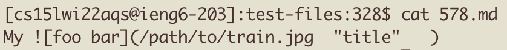

# Lab Report 5

## How to find different resutls?
First of all, by using `bash script.sh > results.txt` we can put all the output from the script into one text file, this will set us up to compare the results of the two different programs much easier.

When we have both of the results.txt, we can simply utilize the `diff` command to compare the two text files. Using `diff diff our-markdown-parse/results.txt markdown-parse/results.txt` we can compare the lines which are different in the results.

## One test that was different

On line 1067 in our group's results.txt, we had a different output than that of the given markdown-parse.

By going to line 1067 in the results, we can see the file that corresponded to this output.

And finally we can get the data in that file with the `cat` command.

As we can see, the main issue with our output was the fact that this was the syntax for an image rather than an url. And so, I believe that our implementation that returned an url should be wrong, and the no url returned by the other program was correct.
The issue lies in that in our program, we didn't have a check for exclamaiton marks which determines if its an image or url. Which resulted in this issue.

## Other test that was different

On line 921 in our group's results.txt, we had a different output than that of the given markdown-parse.

By going to line 921 in the results, we can see the file that corresponded to this output.

And finally we can get the data in that file with the `cat` command.

Here, the issue is because of the multitude of nested brackets messed with our code. Despite whatever was inside the brackets, the outside bracket parenthese pair meant that is should be considered an url link. Which means that our result of no link was incorrect, and the link found by the other program was correct.
The issue with the code for this example is in how we processed brackets, as that we simply looked for the very next closebracket after the open bracket. What this resulted in was that we would find the wrong closing bracket, and because that wrong bracket's position was not right for a url format with no parenthese behind it, we ruled it out and skipped this url. So the fix would be to have some sort of a stack in order to make sure that we find the right closingbraket and not the ones that closes other openbrackets. 

